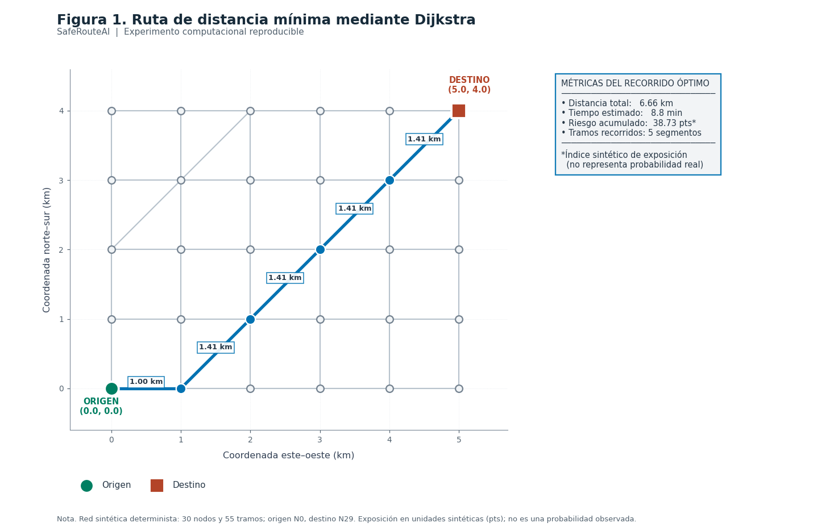
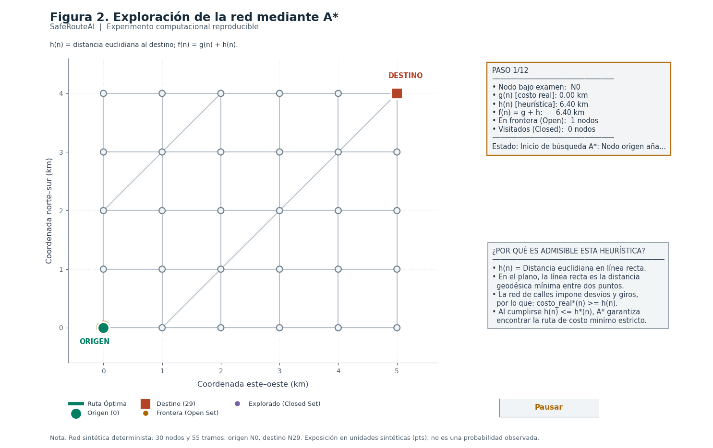
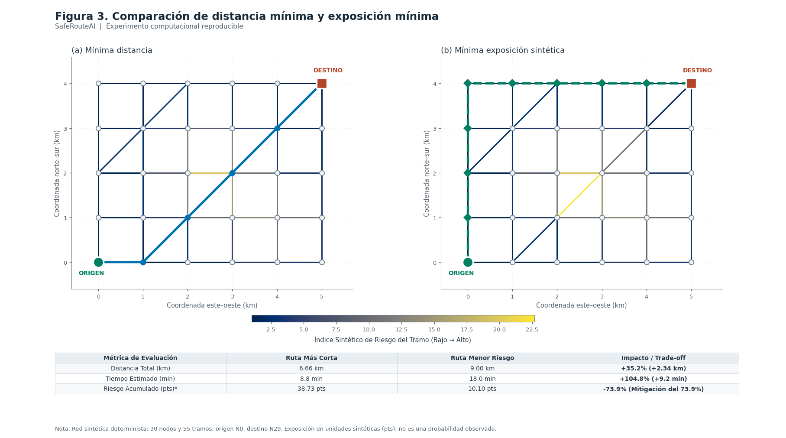
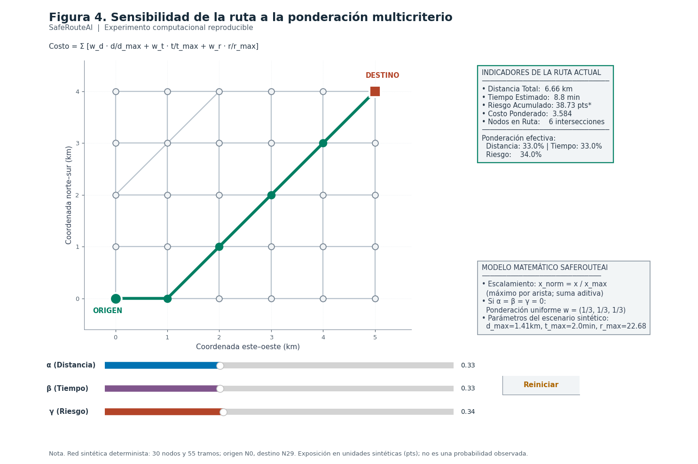
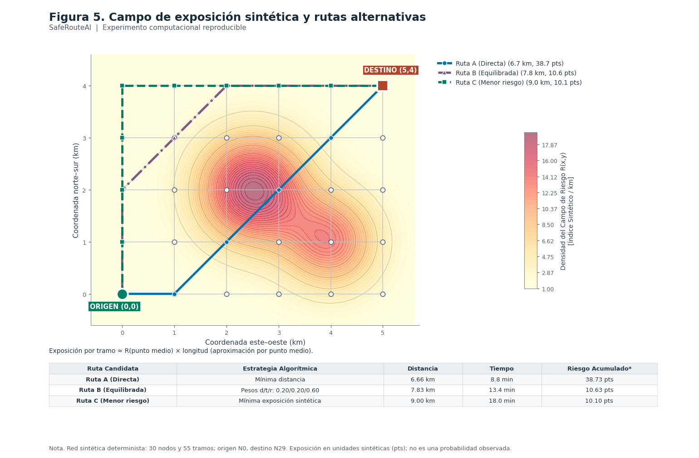
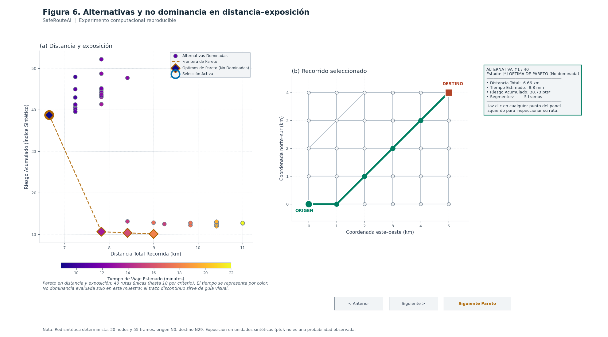

# Figuras de investigación de SafeRouteAI

Los seis programas numerados conservan sus puntos de entrada. Requieren Python, NumPy, NetworkX y Matplotlib; `estilo_investigacion.py` debe permanecer en la misma carpeta.

## Revisión realizada

- Se conserva la precisión de los pesos durante los cálculos; el redondeo se limita a las etiquetas. Esto evita que una diagonal redondeada a 1.414 km resulte menor que la heurística euclidiana de A*.
- Pareto indica el número real de rutas únicas y distingue la no dominancia en distancia y exposición del tiempo codificado por color. Su comparación numérica tolera diferencias menores de 1e-10; la selección con clic usa distancia en pantalla.
- La exposición por arista es una aproximación por punto medio: R(punto medio) × longitud; no una integración exacta ni una probabilidad de delito. Los textos ya reflejan esta distinción.

## Alcance metodológico

La red es un escenario determinista de 30 nodos y 55 aristas, con longitudes euclidianas y velocidades asignadas de 30 o 50 km/h. Aunque los constructores conservan el argumento `semilla`, no hay muestreo aleatorio en este escenario. Los tiempos no incluyen tránsito observado ni demoras en cruces.

La función multicriterio suma costos por arista normalizados respecto al máximo de cada variable en la red. Los pesos se normalizan por su suma; con tres ceros se usa ponderación uniforme. Los máximos por arista no son máximos por ruta.

La figura de Pareto reúne hasta 18 caminos por cada criterio (distancia, tiempo y exposición) y elimina rutas duplicadas. La configuración actual produce 40 rutas únicas. La frontera solo se refiere a esta muestra; no demuestra haber obtenido todas las soluciones no dominadas de la red. La línea discontinua une soluciones discretas como guía visual, sin implicar rutas intermedias factibles.

## Validación

`python graficas/validar_graficas.py` desde la raíz del proyecto comprueba A* frente a Dijkstra en 900 pares, consistencia de la heurística, limpieza y pausa de la animación, criterios puros, pesos nulos, sliders y selección de los 40 candidatos.

`python graficas/revision_visual.py` genera imágenes de revisión en `graficas/revision` mediante un backend sin ventanas. Esta utilidad de comprobación es independiente de la interfaz de las figuras. Las seis figuras se renderizaron y se inspeccionó su composición; los callbacks se comprobaron programáticamente, sin una sesión GUI nativa.

## Gráficas

### 01. Ruta más corta con Algoritmo de Dijkstra

### 02. Búsqueda de rutas con Algoritmo A* (Animación)

### 03. Ruta más corta frente a ruta con menor riesgo

### 04. Optimización multicriterio con sliders interactivos

### 05. Mapa de calor de riesgo y rutas alternativas

### 06. Gráfica de alternativas y frontera de Pareto

